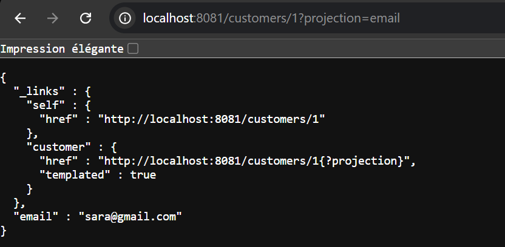
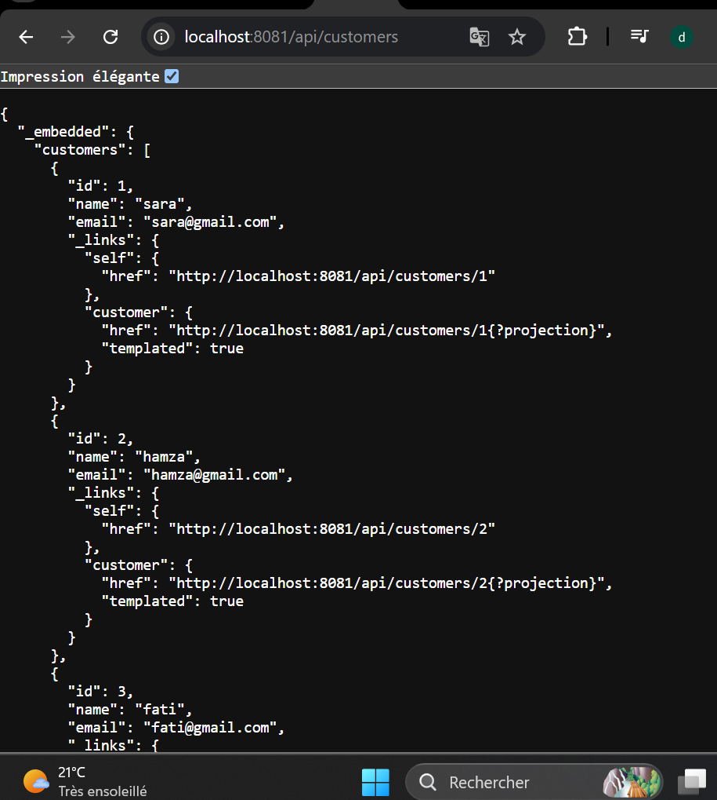
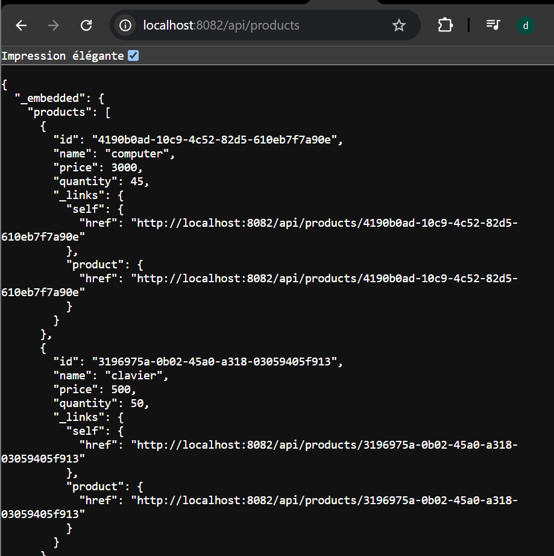
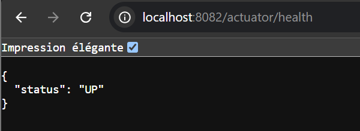
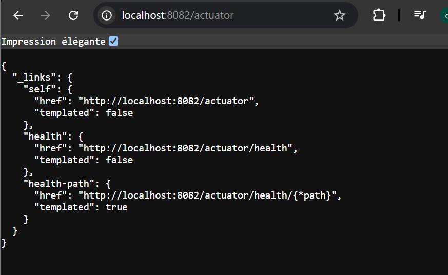

# Gestion de Factures - Architecture Microservices

## 📋 Description du Projet

Application distribuée basée sur une architecture microservices permettant de gérer des factures contenant des produits et appartenant à des clients. Le projet implémente les bonnes pratiques de Spring Cloud avec découverte de services, routage dynamique et gestion centralisée.

## 🏗️ Architecture

L'application est composée de plusieurs microservices interconnectés :

```
├── customer-service (Port: 8081)
├── inventory-service (Port: 8082)
├── gateway-service (Port: 8888)
└── eureka-discovery-service (Port: 8761)
```

---

## 🔧 Microservices

### 1. Customer Service (Port: 8081)

**Fonctionnalités :**
- Gestion complète des clients (CRUD)
- Base de données H2 embarquée
- Support des projections JPA (exemple: projection email)
- API REST pour la manipulation des données clients

**Endpoints principaux :**
```
GET    /api/customers           - Liste tous les clients
GET    /api/customers/{id}      - Récupère un client par ID
POST   /api/customers           - Crée un nouveau client
PUT    /api/customers/{id}      - Met à jour un client
DELETE /api/customers/{id}      - Supprime un client
```

**Configuration application.properties :**
```properties
spring.application.name=customer-service
server.port=8081
spring.datasource.url=jdbc:h2:mem:customerdb
spring.h2.console.enabled=true
eureka.client.service-url.defaultZone=http://localhost:8761/eureka/
```

#### Base de données H2


La console H2 permet de visualiser et gérer la base de données en temps réel.

#### Projection Email



Les projections JPA permettent d'optimiser les requêtes en ne récupérant que les champs nécessaires.

#### Liste des Customers



Affichage de tous les clients enregistrés au format JSON.

---

### 2. Inventory Service (Port: 8082)

**Fonctionnalités :**
- Gestion du catalogue de produits
- Monitoring avec Spring Boot Actuator
- Endpoints de santé et métriques

**Endpoints principaux :**
```
GET    /api/products           - Liste tous les produits
GET    /api/products/{id}      - Récupère un produit par ID
POST   /api/products           - Crée un nouveau produit
PUT    /api/products/{id}      - Met à jour un produit
DELETE /api/products/{id}      - Supprime un produit
```

**Configuration application.properties :**
```properties
spring.application.name=inventory-service
server.port=8082
management.endpoints.web.exposure.include=*
management.endpoint.health.show-details=always
eureka.client.service-url.defaultZone=http://localhost:8761/eureka/
```

**Dépendance Actuator :**
```xml
<dependency>
    <groupId>org.springframework.boot</groupId>
    <artifactId>spring-boot-starter-actuator</artifactId>
</dependency>
```

#### Liste des Produits



Catalogue complet des produits avec identifiants UUID.

#### État du Service (Actuator Health)



Endpoint `/actuator/health` montrant l'état de santé du service.

#### Actuator Endpoints



Accès à `http://localhost:8082/actuator` listant tous les endpoints disponibles :
- `/actuator/health` - État de santé
- `/actuator/info` - Informations de l'application
- `/actuator/metrics` - Métriques de performance
- `/actuator/env` - Variables d'environnement

---

### 3. Gateway Service (Port: 8888)

Point d'entrée unique pour tous les microservices. Implémente deux modes de routage.

**Dépendances principales :**
```xml
<dependency>
    <groupId>org.springframework.cloud</groupId>
    <artifactId>spring-cloud-starter-gateway</artifactId>
</dependency>
<dependency>
    <groupId>org.springframework.cloud</groupId>
    <artifactId>spring-cloud-starter-netflix-eureka-client</artifactId>
</dependency>
```

#### 🔹 Routage Statique

Configuration via `application.yml` :

```yaml
server:
  port: 8888

spring:
  application:
    name: gateway-service
  cloud:
    gateway:
      mvc:
        routes:
          # Route 1 : Redirige /api/customers/** vers customer-service
          - id: customer-service
            uri: http://localhost:8081
            predicates:
              - path=/api/customers/**
          
          # Route 2 : Redirige /api/products/** vers inventory-service
          - id: product-service
            uri: http://localhost:8082
            predicates:
              - path=/api/products/**
```

##### Accès aux Produits via Gateway (Statique)


`http://localhost:8888/api/products`

##### Accès aux Customers via Gateway (Statique)


`http://localhost:8888/api/customers`

#### 🔹 Routage Dynamique (avec Eureka)

**Configuration dans la classe principale :**

```java
@SpringBootApplication
public class GatewayServiceApplication {

    public static void main(String[] args) {
        SpringApplication.run(GatewayServiceApplication.class, args);
    }

    @Bean
    DiscoveryClientRouteDefinitionLocator discoveryClientRouteDefinitionLocator(
        ReactiveDiscoveryClient reactiveDiscoveryClient,
        DiscoveryLocatorProperties discoveryLocatorProperties) {
        return new DiscoveryClientRouteDefinitionLocator(
            reactiveDiscoveryClient, 
            discoveryLocatorProperties
        );
    }
}
```

**Accès via Gateway (mode dynamique) :**
```
http://localhost:8888/INVENTORY-SERVICE/api/products
http://localhost:8888/CUSTOMER-SERVICE/api/customers
http://localhost:8888/INVENTORY-SERVICE/api/products/{id}
```

##### Accès aux Produits via Gateway (Dynamique)


`http://localhost:8888/INVENTORY-SERVICE/api/products`

##### Accès aux Customers via Gateway (Dynamique)


`http://localhost:8888/CUSTOMER-SERVICE/api/customers`

##### Accès à un Produit Spécifique par UUID


`http://localhost:8888/INVENTORY-SERVICE/api/products/92a4e37e-664e-4d3f-aad9-13a096898871`

**Avantages du routage dynamique :**
- ✅ Découverte automatique des services via Eureka
- ✅ Pas besoin de configuration manuelle des routes
- ✅ Load balancing automatique
- ✅ Résilience accrue

---

### 4. Eureka Discovery Service (Port: 8761)

**Fonctionnalités :**
- Registre de services centralisé
- Découverte automatique des microservices
- Interface web de monitoring

**Dépendance Eureka Server :**
```xml
<dependency>
    <groupId>org.springframework.cloud</groupId>
    <artifactId>spring-cloud-starter-netflix-eureka-server</artifactId>
</dependency>
```

**Configuration application.properties :**
```properties
spring.application.name=eureka-discovery-service
server.port=8761
eureka.client.register-with-eureka=false
eureka.client.fetch-registry=false
```

**Annotation dans la classe principale :**
```java
@SpringBootApplication
@EnableEurekaServer
public class EurekaDiscoveryServiceApplication {
    public static void main(String[] args) {
        SpringApplication.run(EurekaDiscoveryServiceApplication.class, args);
    }
}
```

#### Eureka Dashboard


Dashboard accessible à `http://localhost:8761` montrant :
- Tous les services enregistrés
- Statut en temps réel (UP/DOWN)
- Nombre d'instances par service
- Informations détaillées sur chaque microservice

---

## 🚀 Démarrage de l'Application

### Prérequis

- Java 17 ou supérieur
- Maven 3.6+
- IDE (IntelliJ IDEA, Eclipse, VS Code)

### Ordre de démarrage recommandé :

#### 1. Eureka Discovery Service (Port 8761)
```bash
cd eureka-discovery-service
mvn clean install
mvn spring-boot:run
```
✅ Vérifier : `http://localhost:8761`

#### 2. Customer Service (Port 8081)
```bash
cd customer-service
mvn clean install
mvn spring-boot:run
```

#### 3. Inventory Service (Port 8082)
```bash
cd inventory-service
mvn clean install
mvn spring-boot:run
```

#### 4. Gateway Service (Port 8888)
```bash
cd gateway-service
mvn clean install
mvn spring-boot:run
```

### Vérification du démarrage :

1. **Vérifier Eureka Dashboard :** `http://localhost:8761`
  - Tous les services doivent apparaître enregistrés

2. **Tester les services via Gateway :**
   ```bash
   curl http://localhost:8888/CUSTOMER-SERVICE/api/customers
   curl http://localhost:8888/INVENTORY-SERVICE/api/products
   ```

3. **Vérifier Actuator :**
   ```bash
   curl http://localhost:8082/actuator/health
   ```

---

## 📦 Technologies Utilisées

| Technologie | Version | Usage |
|------------|---------|-------|
| Spring Boot | 3.x | Framework principal |
| Spring Cloud Gateway | 4.x | API Gateway (Reactive) |
| Spring Cloud Netflix Eureka | 4.x | Service Discovery |
| Spring Data JPA | 3.x | Persistence |
| H2 Database | 2.x | Base de données embarquée |
| Spring Boot Actuator | 3.x | Monitoring et métriques |
| Maven | 3.6+ | Gestion des dépendances |
| Java | 17+ | Langage de programmation |

---

## 🔍 Endpoints Principaux

### Via Gateway (Routage Statique)

**Customers :**
```
http://localhost:8888/api/customers
http://localhost:8888/api/customers/{id}
```

**Products :**
```
http://localhost:8888/api/products
http://localhost:8888/api/products/{id}
```

### Via Gateway (Routage Dynamique)

**Customers :**
```
http://localhost:8888/CUSTOMER-SERVICE/api/customers
http://localhost:8888/CUSTOMER-SERVICE/api/customers/{id}
```

**Products :**
```
http://localhost:8888/INVENTORY-SERVICE/api/products
http://localhost:8888/INVENTORY-SERVICE/api/products/{id}
```

### Monitoring

**Actuator :**
```
http://localhost:8082/actuator
http://localhost:8082/actuator/health
http://localhost:8082/actuator/info
http://localhost:8082/actuator/metrics
```

**Service Discovery :**
```
http://localhost:8761
```

---

## 🛠️ Structure du Projet

```
microservices-billing/
│
├── eureka-discovery-service/
│   ├── src/
│   │   ├── main/
│   │   │   ├── java/
│   │   │   └── resources/
│   │   │       └── application.properties
│   │   └── test/
│   └── pom.xml
│
├── customer-service/
│   ├── src/
│   │   ├── main/
│   │   │   ├── java/
│   │   │   └── resources/
│   │   │       ├── application.properties
│   │   │       ├── img.png
│   │   │       ├── img_1.png
│   │   │       └── img_2.png
│   │   └── test/
│   └── pom.xml
│
├── inventory-service/
│   ├── src/
│   │   ├── main/
│   │   │   ├── java/
│   │   │   └── resources/
│   │   │       ├── application.properties
│   │   │       ├── img_3.png
│   │   │       ├── img_4.png
│   │   │       └── img_4actuator.png
│   │   └── test/
│   └── pom.xml
│
├── gateway-service/
│   ├── src/
│   │   ├── main/
│   │   │   ├── java/
│   │   │   └── resources/
│   │   │       └── application.yml
│   │   └── test/
│   └── pom.xml
│
├── img.png
├── img_1.png
├── img_2.png
├── img_3.png
├── img_4.png
├── img_5.png
└── README.md
```

---

## 🎯 Fonctionnalités Avancées

### Projections JPA

Les projections permettent d'optimiser les requêtes en ne récupérant que les champs nécessaires :

```java
public interface CustomerEmailProjection {
    String getEmail();
    String getName();
}

// Utilisation dans le Repository
public interface CustomerRepository extends JpaRepository<Customer, Long> {
    List<CustomerEmailProjection> findAllProjectedBy();
}
```

### Spring Boot Actuator

Configuration pour exposer les endpoints de monitoring :

```properties
management.endpoints.web.exposure.include=health,info,metrics,env
management.endpoint.health.show-details=always
management.info.env.enabled=true
```

### Service Discovery avec Eureka

Enregistrement automatique des services :
- Heartbeat toutes les 30 secondes
- Renouvellement automatique du bail
- Détection des services défaillants
- Load balancing côté client

---

## 🐛 Dépannage

### Problème : Service non enregistré dans Eureka

**Solution :**
- ✅ Vérifier que Eureka Server est démarré (`http://localhost:8761`)
- ✅ Vérifier la configuration `eureka.client.service-url.defaultZone`
- ✅ Attendre 30 secondes (délai d'enregistrement)
- ✅ Vérifier les logs du service

### Problème : Gateway ne trouve pas les services

**Solution :**
- ✅ Vérifier que le routage dynamique est activé
- ✅ Utiliser le nom du service en **MAJUSCULES** dans l'URL
- ✅ Vérifier que les servic