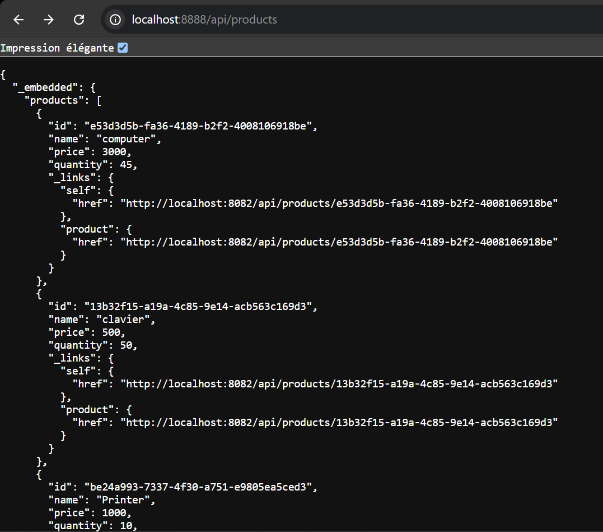
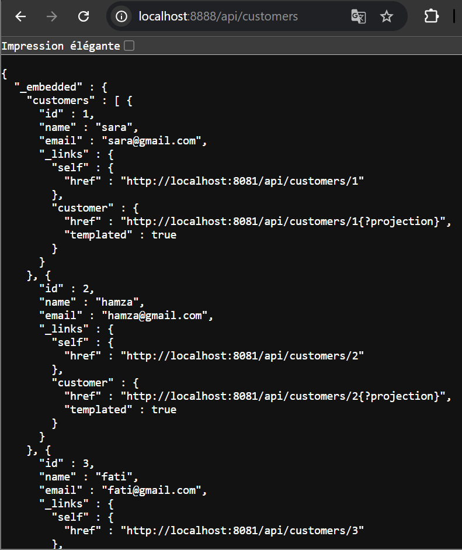
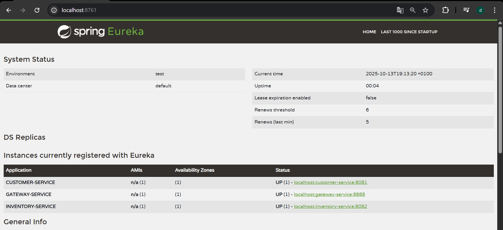

gateway
route static avec fichier application.yml 
/**
server:
port: 8888

spring:
application:
name: gateway-service

cloud:
gateway:
mvc:
routes:
#Route 1 : redirige les requêtes /api/customers/** vers le microservice client
- id: customer-service
uri: http://localhost:8081
predicates:
path= /api/customers/**

          #Route 2 : redirige les requêtes /api/products/** vers le microservice produit
          - id: product-service
            uri: http://localhost:8082
            predicates:
              path= /api/products/**
**/
http://localhost:8888/api/products

http://localhost:8888/api/customers

l'annuaire Eureka Discrovery Service
