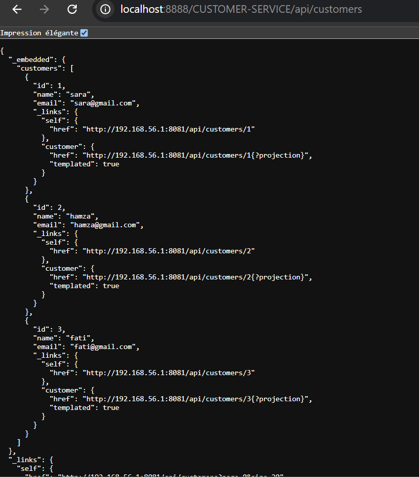

gateway
route static avec fichier application.yml 
/**
server:
port: 8888

spring:
application:
name: gateway-service

cloud:
gateway:
mvc:
routes:
#Route 1 : redirige les requêtes /api/customers/** vers le microservice client
- id: customer-service
uri: http://localhost:8081
predicates:
path= /api/customers/**

          #Route 2 : redirige les requêtes /api/products/** vers le microservice produit
          - id: product-service
            uri: http://localhost:8082
            predicates:
              path= /api/products/**
**/
http://localhost:8888/api/products

http://localhost:8888/api/customers

l'annuaire Eureka Discrovery Service

une configuration dynamique des routes de la gateway
ajouter la depandance reactive gateway
<dependency>
<groupId>org.springframework.cloud</groupId>
<artifactId>spring-cloud-starter-gateway</artifactId>
</dependency>
ajouter ca dans le fichier main de gateway service
@Bean
DiscoveryClientRouteDefinitionLocator discoveryClientRouteDefinitionLocator
(ReactiveDiscoveryClient reactiveDiscoveryClient, DiscoveryLocatorProperties discoveryLocatorProperties) {
return new DiscoveryClientRouteDefinitionLocator(reactiveDiscoveryClient, discoveryLocatorProperties);
}
http://localhost:8888/INVENTORY-SERVICE/api/products

http://localhost:8888/CUSTOMER-SERVICE/api/customers

http://localhost:8888/INVENTORY-SERVICE/api/products/92a4e37e-664e-4d3f-aad9-13a096898871
